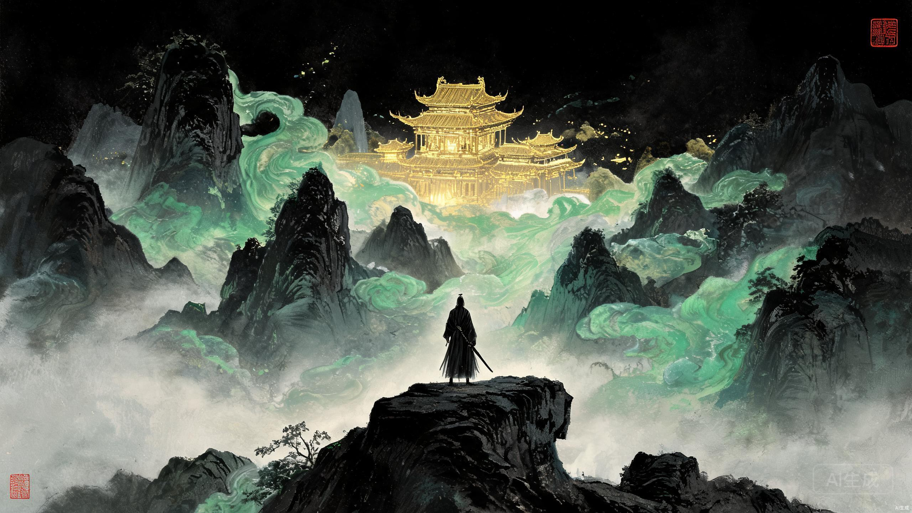
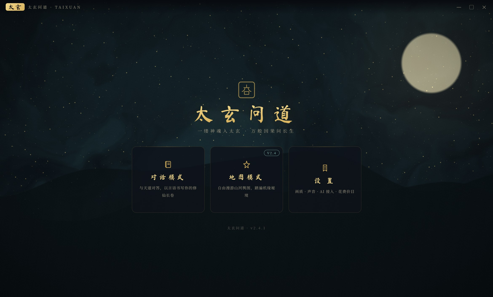
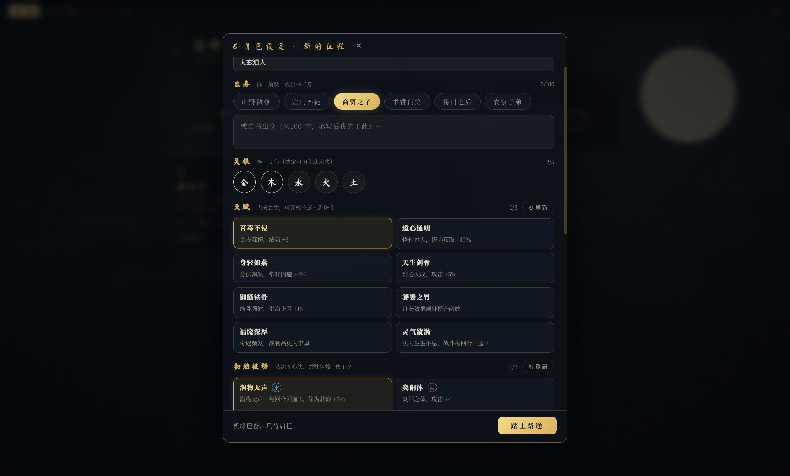
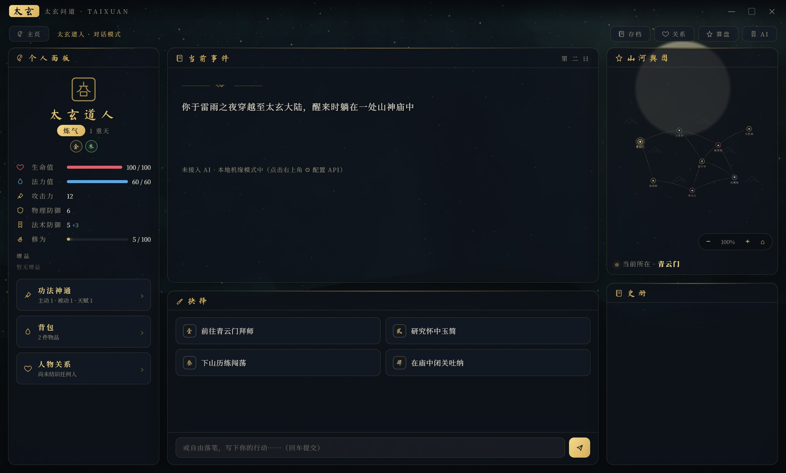
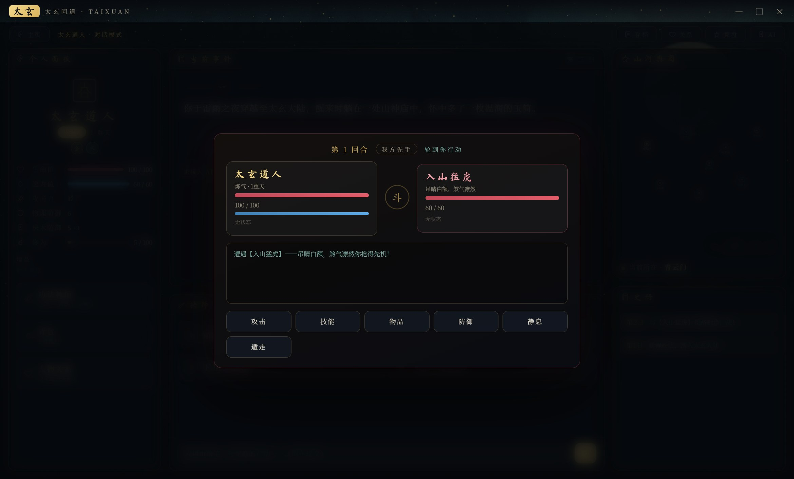
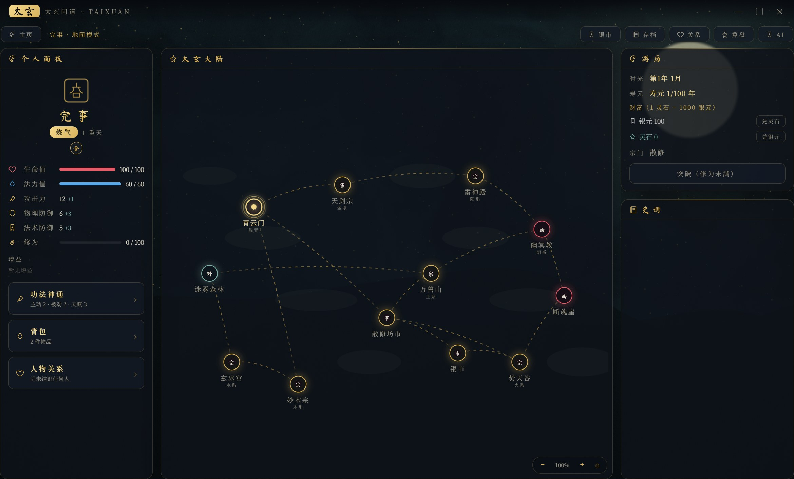
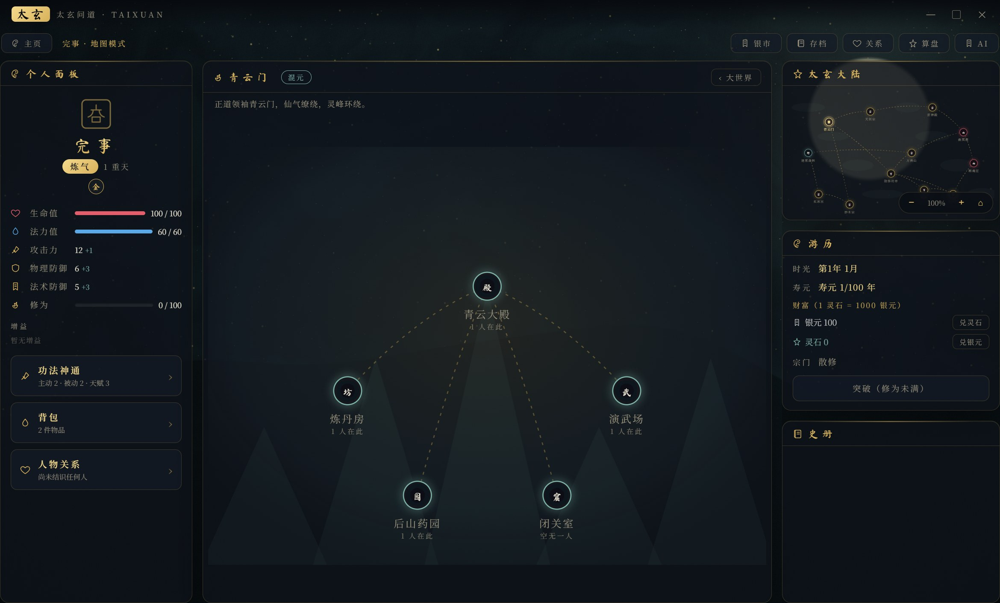
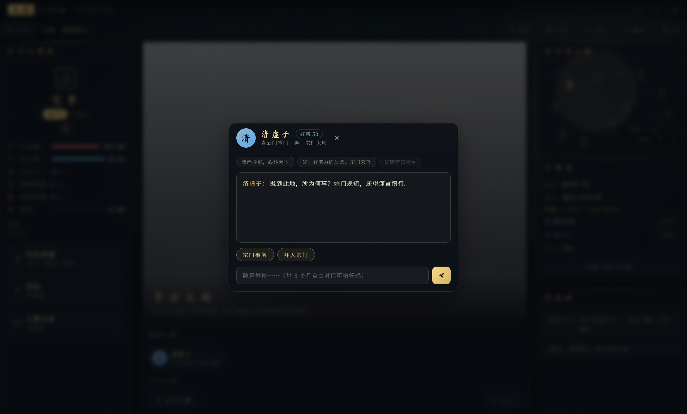
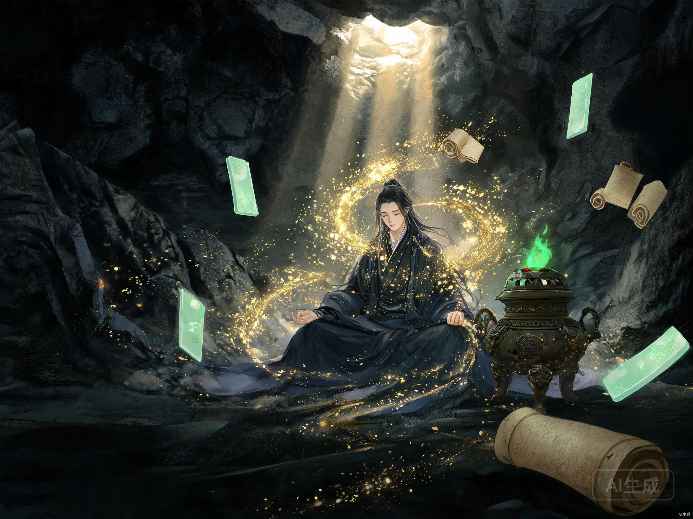

<div align="center">

# Taixuan: Quest for Immortality · 太玄问道

[简体中文](./README.md) | **English**

</div>



> Fellow cultivator, it's the AI era — why are you still grinding through sect lectures?

**Taixuan: Quest for Immortality** is an AI-driven Eastern xianxia (immortal cultivation) text game. Built on Electron with a WebGL soul and SVG-painted landscapes, a large language model generates the story in real time — every journey is unique, and every cultivator's path to the Dao is written by the Heavens themselves.

<div align="center">


</div>

---

## 📸 Gallery

| Main Menu | Character Creation |
|:---:|:---:|
|  |  |

| Dialogue Mode | Turn-based Combat |
|:---:|:---:|
|  |  |

| World Map | Sect Region |
|:---:|:---:|
|  |  |

| Scene View & NPC Dialogue |
|:---:|
|  |

---

## ✨ Features

### Dual-Mode Gameplay

- **Dialogue Mode**: A text adventure with AI-generated storylines. Events, choices, battles, and fortunes are all penned by the LLM — or type your own actions freely and watch them become legend.
- **Map Mode**: Roam the Taixuan Continent at will. Three-level navigation (**World → Sect/Region → Scene**), pure-SVG maps with scroll-zoom and drag-pan. If you can see it, you can go there.
- **Isolated Saves**: Each mode keeps its own characters and save slots — no interference, two paths to the Dao.

### Cultivation Systems

- **Character Growth**: Realm breakthroughs (Qi Refining → Foundation Establishment → Golden Core → Nascent Soul → Spirit Transformation…), Five-Element spiritual roots, attribute training, talents and techniques. In Map Mode, a full cultivation bar demands a manual breakthrough attempt — success or failure is up to Heaven.
- **Eight Great Sects**: Qingyun Sect (Primordial), Fentian Valley (Fire), Xuanbing Palace (Water), Wanshou Mountain (Earth), Netherworld Cult (Yin), Heavenly Sword Sect (Metal), Miaomu Sect (Wood), Thunder Temple (Yang) — each with entry requirements, cultivation bonuses, and exclusive scenes.
- **Combat System**: System-driven turn-based combat with a three-layer resolution architecture (Effect layer / Buff layer / Skill layer); the AI pilots enemy actions. Sparring ends at first touch; deathmatches are deadly serious.
- **Alchemy & Seclusion**: Gather herbs and brew pills per recipe — pill quality scales with your alchemy level and herb grade. Enter seclusion to trade time for cultivation… but watch your lifespan.
- **Economy**: Silver and spirit stones with two-way exchange, market trading, and sect quests for bounty.



### Characters & World

- **Character Creation**: On a new journey, customize 1–5 spiritual roots, 0–3 talents, and initial passive/active skills (tied to your roots). AI-generated candidates, refreshable indefinitely.
- **Relationships**: A dozen-plus NPCs with distinct personalities — sect masters, elders, herb boys, information brokers… Every greeting is recorded; affinity shapes your sect fortunes.
- **Items**: Seven quality tiers (Common · Fine · Refined · Epic · Legendary · Primordial · Origin), spanning pills, artifacts, techniques, materials, and curios. Items can grant buffs, skills, or talents.
- **Save System**: Multiple characters × multiple slots, per-domain file storage + autosave, load anytime. Saves live in the system user directory — never lost to updates or reinstalls.
- **Cost Statistics**: Real-time tracking of AI usage and spending, with cache hit rates and stacked charts at a glance.

## 🚀 Getting Started

### Download & Launch (ECO Launcher)

This project is integrated with the ECO launcher: grab `taixuan-quest-for-immortality-x.x.x-eco.tar.gz` (an ECO-friendly archive) from the [Releases](https://github.com/Muelsyselove/Taixuan-Quest-for-Immortality/releases) page. Planting this project with ECO is recommended — ECO handles download, extraction, dependency assembly, launch, and update notifications automatically.

### Run Locally (Development)

```bash
# Clone the repository
git clone https://github.com/Muelsyselove/Taixuan-Quest-for-Immortality.git
cd Taixuan-Quest-for-Immortality

# Install dependencies
npm install

# Start the game
npm start
```

> Requirements: Node.js ≥ 20, Windows 7/10/11.

### Self-check

```bash
npm run selfcheck
```

A full-feature regression driven by Playwright over Electron: main menu → character creation → both game modes → combat → save round-trip → cost statistics, all automated.

### Refresh Screenshots

```bash
node scripts/screenshot.js
```

Walks through key screens automatically and outputs screenshots to `docs/images/`.

## 🔑 AI Configuration

After first launch, click the **Settings** button (⚙) in the title bar and fill in your AI provider info:

1. **Choose a provider**: DeepSeek, Moonshot Kimi, Zhipu GLM, Alibaba Tongyi Qianwen, ByteDance Doubao, and MiniMax are built in — or any OpenAI-compatible endpoint (custom Base URL).
2. **Enter your API key**: obtained from the provider's platform.
3. **Pick a model**: e.g. `deepseek-chat`, `kimi-k2-turbo-preview`, `glm-4.6`.

The game also runs without a key in "No-AI mode" using built-in fallback content, but story richness drops dramatically — configuring an API key is strongly recommended for the full experience.

## 🏗️ Project Structure

```
Taixuan-Quest-for-Immortality/
├── main.js                  # Electron main process (window / IPC / save I/O)
├── preload.js               # Preload script (contextBridge whitelisted IPC)
├── package.json             # Dependencies & scripts
├── eco-manifest.json        # ECO launcher manifest (dependency + launch commands)
├── docs/images/             # README images
├── scripts/
│   ├── release.mjs          # Release script (3-way version sync + ECO pack + tag push)
│   └── screenshot.js        # README screenshot script
├── .github/workflows/       # eco-release: build & publish ECO archive on tag push
├── renderer/                # Renderer layer (frontend)
│   ├── index.html           # Entry HTML
│   ├── styles/              # "Ink & Gilt" theme (split by domain, aggregated by main.css)
│   │   ├── main.css         # Aggregate entry (@import cascade: base→game→creation→menu→ui→map)
│   │   ├── base.css         # Theme variables / reset / title bar / layout / scrollbars
│   │   ├── game.css         # Dialogue-mode interface
│   │   ├── creation.css     # Character creation (new journey)
│   │   ├── menu.css         # Main menu / character & save selection / settings
│   │   ├── ui.css           # Shared UI kit (Tabs / forms / charts / stats)
│   │   └── map.css          # Map mode (3-level nav / scenes / NPCs / alchemy / breakthrough)
│   └── src/
│       ├── main.js          # Renderer entry
│       ├── core/            # Game kernel (pure logic, DOM-free)
│       │   ├── config.js    # Game config (realms / items / prompts / roots / AI vendors)
│       │   ├── store.js     # State kernel: read-write / pub-sub / effect resolution / derived stats
│       │   ├── domains/     # State-domain methods (Object.assign mixed into store prototype)
│       │   │   ├── skills.js       # Skills & buffs
│       │   │   ├── items.js        # Items
│       │   │   ├── relations.js    # NPC relationships
│       │   │   ├── mapMode.js      # Map mode (travel / seclusion / alchemy / breakthrough)
│       │   │   ├── wealth.js       # Wealth / shops / sects
│       │   │   └── persistence.js  # Save serialization & character reset
│       │   ├── mapData.js   # Map data aggregate entry + query helpers
│       │   ├── mapData/     # Map data layer (split by domain, read-only for components)
│       │   │   ├── styles.js       # Root styles / facility types
│       │   │   ├── npcs.js         # NPC data
│       │   │   ├── scenes.js       # Scene data
│       │   │   ├── sects.js        # Eight great sects
│       │   │   └── maps.js         # World / second-level map structures
│       │   ├── ai.js        # AI layer (multi-vendor / NPC dialogue / creation generation)
│       │   ├── combat.js    # Combat engine (3-layer resolution: fx / buff / skill)
│       │   ├── fx.js        # Effect-layer atoms & buff builders
│       │   ├── skills.js    # Skill library
│       │   ├── alchemy.js   # Herbs / recipes / alchemy resolution
│       │   ├── breakthrough.js # Breakthrough system
│       │   ├── time.js      # Map time (year/month) & lifespan
│       │   ├── wealth.js    # Wealth conversion
│       │   ├── data.js      # Save domain split / merge
│       │   ├── saves.js     # Save management (local file I/O)
│       │   ├── usageStats.js# Cost statistics
│       │   ├── audio.js     # Sound effects
│       │   └── component.js # UI component base (h function / reactive subscription)
│       ├── components/      # UI components
│       │   ├── svgViewport.js      # SVG viewport (zoom / pan / toolbar, shared by all maps)
│       │   ├── WorldMap.js         # World map (level 1)
│       │   ├── RegionMap.js        # Region map (level 2)
│       │   ├── SceneView.js        # Scene scroll-painting (level 3)
│       │   ├── MapView.js          # Landscape map (dialogue mode)
│       │   └── ...                 # Panels / modals, 20+ components
│       ├── screens/         # Screens (menu / char-select / dialogue / map / saves / settings)
│       ├── ui/              # Shared widgets (Modal / forms / bar chart)
│       └── gl/
│           └── MistRenderer.js     # WebGL mist background
└── selfcheck.js             # Playwright full-feature regression (Electron-driven)
```

### Architecture Highlights

- **State Management**: Single-source-of-truth `GameStore` + key-level pub-sub; business methods split into `core/domains/` and prototype-mixed in, keeping the public API stable.
- **Three-layer Combat Resolution**: Effect layer (`fx.js` atoms) → buff layer (freely composable, stackable) → skill layer (mana cost & structured effects) — clean separation, independently testable.
- **Shared SVG Viewport**: Zoom / pan / drag / toolbar unified in `svgViewport.js`, reused by world map, region maps, and the landscape map.

## 🎨 Design Theme

The **"Ink & Gilt"** (玄墨鎏金) palette — jet-black foundations, gilt edges, cinnabar accents, with jade-green highlights — evokes an ink-wash xianxia aesthetic. Typography pairs `Ma Shan Zheng` for display titles with `Noto Serif SC` for body text.

## 🛠️ Tech Stack

| Category | Technology | Notes |
|----------|-----------|-------|
| Desktop | **Electron 43** | Cross-platform desktop framework (contextIsolation + sandbox security) |
| Rendering | **Native WebGL** | Real-time mist backgrounds (no third-party 3D libraries) |
| Maps | **Native SVG** | World / region / landscape map drawing & interaction |
| Frontend | **Vanilla JavaScript** | No framework — custom lightweight component system (h function + reactive subscriptions) |
| AI | **OpenAI-compatible protocol** | Multi-vendor adapters (DeepSeek / Kimi / GLM / Tongyi / Doubao / MiniMax / custom) |
| Testing | **Playwright** | Electron-driven automated full-feature regression |
| Distribution | **ECO Launcher** | Download / assembly / launch / update (Releases ship ECO-friendly archives) |

## 📦 Release a New Version

```bash
npm run release -- patch --notes "Release notes"
```

Syncs version numbers (package.json / config.js / eco-manifest.json) → self-check → local ECO archive verification → git commit & tag push; a GitHub Action then builds and publishes the ECO archive to a Release.

## 🙏 Acknowledgements

This project stands on the shoulders of the following open-source projects and creators — our heartfelt gratitude:

| Project | Used For | License |
|---------|----------|---------|
| [Electron](https://www.electronjs.org/) | Cross-platform desktop framework | [MIT](https://github.com/electron/electron/blob/main/LICENSE) |
| [Playwright](https://playwright.dev/) | Automated testing & self-checks | [Apache-2.0](https://github.com/microsoft/playwright/blob/main/LICENSE) |
| [Ma Shan Zheng](https://fonts.google.com/specimen/Ma+Shan+Zheng) (font) | Display typeface | [SIL OFL 1.1](https://fonts.google.com/specimen/Ma+Shan+Zheng/license) |
| [Noto Serif SC](https://fonts.google.com/specimen/Noto+Serif+SC) (font) | Body typeface | [SIL OFL 1.1](https://fonts.google.com/specimen/Noto+Serif+SC/license) |
| [ZCOOL XiaoWei](https://fonts.google.com/specimen/ZCOOL+XiaoWei) (font) | Decorative typeface | [SIL OFL 1.1](https://fonts.google.com/specimen/ZCOOL+XiaoWei/license) |
| ECO Launcher (Rhine Lab Ecological Section) | Distribution & auto-update ecosystem | — |

We also thank the AI providers whose open APIs make "a Heaven-penned story" possible.

## 📜 License

This project is open-sourced under the [**GNU Affero General Public License v3.0**](./LICENSE).

**Special Notice**:

- Third-party components referenced or used in this project (including but not limited to Electron, Playwright, and the Google Fonts typefaces listed above) are **NOT governed by this project's license**. They remain under **their original projects' open-source licenses** (MIT / Apache-2.0 / SIL OFL 1.1, etc.), with all rights belonging to their respective authors.
- Do not redistribute third-party components bundled in this repository as if they were part of the AGPL-3.0 grant without separate authorization.

---

<div align="center">

> The heavens are dark, the earth is yellow;
> One thought becomes the Dao — Taixuan asks the way.

[简体中文](./README.md) · **English**

</div>
